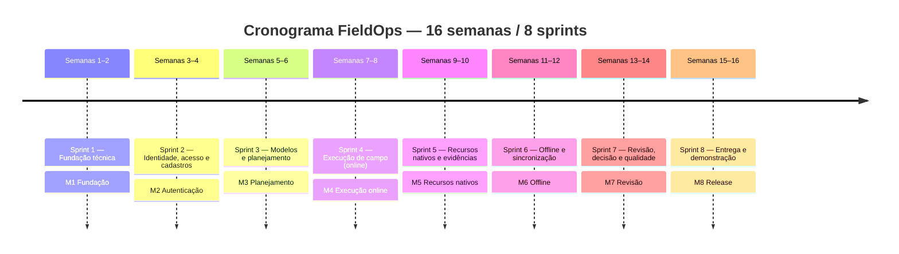
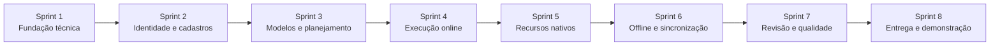

# Cronograma do Projeto FieldOps

> Documento de gestão de projeto acadêmico. Complementa a [`eap.md`](./eap.md) (Estrutura Analítica do Projeto), aplicando-a no tempo por meio de 8 sprints. Toda referência a "EAP relacionada" usa os códigos definidos em `eap.md` §4–5; toda referência a issues usa a numeração confirmada em `eap.md` §2 (US-XX = issue #N; TS-XX-YY = issue #N).

---

## Sumário

1. [Premissas do cronograma](#1-premissas-do-cronograma)
2. [Planejamento das Sprints](#2-planejamento-das-sprints)
3. [Cronograma Consolidado](#3-cronograma-consolidado)
4. [Entregáveis por Sprint](#4-entregáveis-por-sprint)
5. [Milestones](#5-milestones)
6. [Cronograma Visual](#6-cronograma-visual)
7. [Caminho Crítico](#7-caminho-crítico)
8. [Riscos e Mitigações](#8-riscos-e-mitigações)
9. [Verificação de Equilíbrio das Sprints](#9-verificação-de-equilíbrio-das-sprints)
10. [Recomendações](#10-recomendações)
11. [Validação Final](#11-validação-final)

---

## 1. Premissas do cronograma

A duração das sprints **já está definida** na documentação do projeto — não foi necessário propor uma duração, apenas seguir a fonte existente:

- **16 semanas efetivas de aula** (de um calendário institucional de 20 semanas; as 4 semanas restantes não são dependência do MVP). *(Fonte: `docs/roadmap.md` §16.1)*
- **8 sprints de 2 semanas cada**, com entrega coordenada em mobile, painel administrativo e API a cada sprint, e incremento demonstrável ao final de cada uma. *(Fonte: `docs/roadmap.md` §16.3)*
- Rotina semanal fixa: 2 aulas de conteúdo + 3 aulas de desenvolvimento orientado do projeto, por semana. *(Fonte: `docs/roadmap.md` §16.2)*

Não há, na documentação disponível, **datas de calendário** (dia/mês/ano) associadas ao início do projeto ou de cada sprint — apenas numeração relativa de semanas (Semana 1 a Semana 16). Por isso, este cronograma **não inventa datas civis**: todas as representações temporais usam a numeração relativa de semana/sprint já definida em `roadmap.md`. A seção 6 traz uma representação visual compatível com essa limitação.

O mapeamento `Sprint → User Stories` já vem definido literalmente nos comentários de cabeçalho de `github-kanban/backlog.yaml` (linhas 26–33) e no campo `iteration` de cada item — não foi necessário inferir a distribuição por sprint, apenas consolidá-la.

---

## 2. Planejamento das Sprints

### Sprint 1 — Fundação técnica

**Semanas:** 1–2 *(fonte: `roadmap.md` §16.4)*

**Objetivo:** Ter as três aplicações (mobile, painel web, API) executáveis, padronizadas e com um contrato inicial de integração, para que os times possam avançar em paralelo a partir da Sprint 2.

**Issues:**
- US-01 (#1) — Configurar repositório e convenções de desenvolvimento
- US-02 (#9) — Criar projeto base do aplicativo mobile
- US-03 (#20) — Criar projeto base do painel administrativo web
- US-04 (#26) — Criar API base com Spring Boot conectada ao PostgreSQL

*(29 tasks associadas — ver `eap.md` §2.4)*

**EAP relacionada:** 1.1, 1.1.1, 1.1.2, 1.1.3, 1.1.4

**Principais atividades:**
- Definir estrutura de pastas, lint, TypeScript strict e hooks de qualidade nos três repositórios.
- Inicializar Expo Router (mobile) e Angular Router (web) com rotas públicas/protegidas mockadas.
- Inicializar Spring Boot com Security, JPA, Validation, OpenAPI, PostgreSQL e Flyway.
- Publicar contrato inicial de autenticação e enums (US-01, critério de aceitação "contrato inicial de autenticação e enums definidos").

**Dependências:** Nenhuma dependência externa — é a sprint de fundação. Internamente, US-02/US-03/US-04 dependem de US-01 (convenções) — ver `eap.md` §3.1.

**Entregável:** Três aplicações executáveis localmente, com rotas navegáveis (dados mockados no mobile e no painel) e uma API respondendo com PostgreSQL + migrations + OpenAPI publicado.

**Critério de conclusão:** As três aplicações sobem sem erro; lint e verificação de tipos passam nos três repositórios; `/swagger` acessível; navegação mockada funcional em mobile e web.

**Riscos/observações:** Sprint de setup tem baixo risco funcional, mas decisões de estrutura de pastas e convenções tomadas aqui (US-01) afetam todas as sprints seguintes — atraso aqui compromete diretamente a Sprint 2.

---

### Sprint 2 — Identidade, acesso e cadastros

**Semanas:** 3–4

**Objetivo:** Ter autenticação real (JWT) funcionando nas duas frontends e os cadastros operacionais (usuários, clientes, locais, equipamentos) disponíveis via painel administrativo.

**Issues:**
- US-05 (#34) — Autenticar usuário com e-mail e senha via API
- US-06 (#44) — Gerenciar sessão de login no aplicativo mobile
- US-07 (#53) — Gerenciar sessão de login no painel administrativo web
- US-08 (#59) — Gerenciar usuários do sistema
- US-09 (#68) — Gerenciar clientes, locais e equipamentos

*(41 tasks associadas)*

**EAP relacionada:** 1.2, 1.2.1, 1.2.2, 1.2.3, 1.2.4, 1.3, 1.3.1

**Principais atividades:**
- Implementar entidade `User`, Spring Security com filtro JWT, endpoints de login/refresh/logout.
- Integrar login real no mobile (SecureStore) e no painel (interceptador Bearer + refresh automático).
- Implementar CRUD de usuários com autorização por perfil.
- Implementar cadastro encadeado cliente → local → equipamento, com QR Code único por equipamento.

**Dependências:** Bloqueante em relação a US-04 (Sprint 1, base da API). US-08 e US-09 dependem de US-05/US-07 (sessão administrativa autenticada) — ver `eap.md` §3.1.

**Entregável:** Login funcional ponta a ponta (mobile e web) contra a API real; administrador consegue cadastrar usuários, clientes, locais e equipamentos pelo painel, sem acesso direto ao banco.

**Critério de conclusão:** Login/logout/refresh funcionam nas duas interfaces; técnico bloqueado em endpoints administrativos; equipamento cadastrado exibe QR Code único; registro inativo não pode ser usado em nova inspeção (validação antecipada, embora "inspeção" só exista a partir da Sprint 3).

**Riscos/observações:** É a sprint com maior volume do projeto (42 pontos, 46 issues incluindo as 5 User Stories) — ver análise de equilíbrio na Seção 9. US-09 sozinha concentra 13 pontos e 11 tasks.

---

### Sprint 3 — Modelos de inspeção e planejamento

**Semanas:** 5–6

**Objetivo:** Permitir que o supervisor construa e publique um modelo de inspeção, e agende/atribua uma inspeção a um técnico a partir dele.

**Issues:**
- US-10 (#80) — Criar e configurar modelo de inspeção em rascunho
- US-11 (#92) — Publicar versão imutável do modelo de inspeção
- US-12 (#99) — Agendar e atribuir inspeção a um técnico
- US-13 (#107) — Acompanhar e cancelar inspeções agendadas

*(29 tasks associadas)*

**EAP relacionada:** 1.4, 1.4.1, 1.4.2, 1.5, 1.5.1, 1.5.2

**Principais atividades:**
- Construtor de modelo com seções/itens ordenáveis e tipos de resposta (texto, número, booleano, conformidade, seleção, data, foto).
- Publicação com validação pré-publicação, numeração de versão e imutabilidade.
- Formulário de agendamento com seleção encadeada cliente → local → equipamento e técnico ativo.
- Listagem de inspeções com filtros e cancelamento com justificativa auditada.

**Dependências:** Bloqueante em relação a US-09 (cadastros, Sprint 2) e US-11 (publicação precede agendamento, dentro da própria sprint) — ver `eap.md` §3.1.

**Entregável:** Supervisor cria um modelo, publica uma versão imutável e agenda uma inspeção atribuída a um técnico ativo, com snapshot dos itens já gerado.

**Critério de conclusão:** Publicação bloqueada sem seção/item válido; inspeção criada preserva snapshot da versão; local pertence ao cliente e equipamento ao local selecionados; cancelamento exige justificativa.

**Riscos/observações:** É o marco M3 do roadmap ("Modelo e inspeção criados pela web"). O conceito de *snapshot imutável* introduzido aqui é pré-requisito conceitual para toda a Sprint 4 (execução) — qualquer ambiguidade na estrutura do snapshot se propaga.

---

### Sprint 4 — Execução de campo

**Semanas:** 7–8

**Objetivo:** Técnico executa uma inspeção completa pelo aplicativo mobile, **de ponta a ponta, ainda em modo online** (sem os requisitos de offline, que só entram na Sprint 6).

**Issues:**
- US-14 (#113) — Visualizar inspeções atribuídas no aplicativo mobile
- US-15 (#119) — Iniciar inspeção e registrar horário de início
- US-16 (#125) — Responder checklist dinâmico da inspeção
- US-17 (#137) — Concluir inspeção com validação dos requisitos obrigatórios

*(29 tasks associadas)*

**EAP relacionada:** 1.6, 1.6.1, 1.6.2, 1.6.3, 1.6.4

**Principais atividades:**
- Listar inspeções do técnico autenticado (`GET /me/inspections`) com diferenciação visual de estado.
- Registrar início formal com data/hora do dispositivo e criar entrada na outbox (estrutura de dados preparada, mesmo que o motor de sincronização só seja implementado na Sprint 6).
- Renderizar checklist dinamicamente a partir do snapshot, com componente correto por tipo de resposta e salvamento imediato em SQLite.
- Bloquear conclusão até que todos os itens obrigatórios e evidências exigidas estejam preenchidos.

**Dependências:** Bloqueante em relação a US-12 (inspeção precisa existir) e US-06 (sessão mobile) — ver `eap.md` §3.1.

**Entregável:** Ciclo completo início → resposta → conclusão funcionando no aplicativo mobile contra a API real, sem evidências nativas (foto/QR/GPS ficam para a Sprint 5).

**Critério de conclusão:** Todos os tipos de resposta do enum têm componente funcional; progresso recalculado corretamente; conclusão bloqueada com item obrigatório pendente e destaca as pendências.

**Riscos/observações:** É o marco M4 ("Checklist dinâmico enviado à API"). US-16 é a maior User Story da sprint (13 pontos, 11 tasks) e concentra o maior risco técnico de UI dinâmica do projeto.

---

### Sprint 5 — Recursos nativos e evidências

**Semanas:** 9–10

**Objetivo:** Enriquecer a execução (ainda online) com os recursos nativos do dispositivo — câmera, QR Code e localização — e tornar essas evidências visíveis na revisão administrativa.

**Issues:**
- US-18 (#146) — Identificar equipamento por leitura de QR Code
- US-19 (#152) — Capturar e associar fotografia como evidência do item
- US-20 (#161) — Registrar localização GPS no início e na conclusão
- US-21 (#167) — Registrar não conformidade com criticidade e evidência
- US-22 (#173) — Visualizar evidências e não conformidades no painel administrativo

*(26 tasks associadas)*

**EAP relacionada:** 1.7, 1.7.1, 1.7.2, 1.7.3, 1.7.4, 1.7.5

**Principais atividades:**
- Scanner de QR Code com solicitação de permissão e fallback de identificação manual.
- Captura de foto com prévia, associação ao item e upload multipart (`POST /evidences`).
- Coleta pontual de geolocalização no início e na conclusão.
- Formulário de não conformidade com criticidade e exigência de evidência quando crítica.
- Telas administrativas de visualização de evidências (com zoom) e não conformidades.

**Dependências:** Forte em relação a US-16 (evidências são associadas a itens do checklist já funcional) e a US-09 (QR Code gerado no cadastro de equipamento). US-22 é bloqueante em relação às demais US da própria sprint, pois exibe dados que elas produzem — ver `eap.md` §3.1.

**Entregável:** Inspeção executada online com QR Code, foto e localização, visível de forma consolidada (fotos, NCs, localização) na tela de revisão administrativa.

**Critério de conclusão:** Divergência de QR Code tratada conforme regra; upload de evidência não reverte outros dados confirmados em caso de falha; NC crítica exige evidência; dados visíveis na revisão sem manipulação direta do banco.

**Riscos/observações:** É o marco M5 ("Foto, QR Code e localização"). Envolve a maior concentração de permissões de dispositivo do projeto (câmera + localização) — tratamento de permissão negada é crítico e testado explicitamente nos critérios de aceitação (AC-QR, AC-LOCATION).

---

### Sprint 6 — Offline e sincronização

**Semanas:** 11–12

**Objetivo:** Tornar a execução de campo possível sem conectividade e implementar o motor de sincronização bidirecional (outbox + pull por cursor) com idempotência.

**Issues:**
- US-23 (#177) — Acessar e executar inspeções sem conexão à internet
- US-24 (#183) — Sincronizar operações pendentes com o servidor via outbox
- US-25 (#191) — Baixar alterações do servidor com cursor de sincronização incremental
- US-26 (#198) — Monitorar status de sincronização no aplicativo

*(21 tasks associadas)*

**EAP relacionada:** 1.8, 1.8.1, 1.8.2, 1.8.3, 1.8.4

**Principais atividades:**
- Criar o schema SQLite completo (inspeções, snapshots, respostas, evidências, não conformidades) e o download de inspeção completa para uso offline.
- Implementar a fila outbox com ordenação por dependência, envio em lote e idempotência (rejeição de reenvio duplicado na API).
- Implementar o pull incremental por cursor, avançando apenas após persistência local confirmada, com detecção de conflito.
- Tela de status de sincronização com contagem de pendências e última sincronização bem-sucedida.

**Dependências:** Bloqueante em relação a US-16/US-17 (o fluxo online já precisa funcionar antes de ser adaptado para offline) — ver `eap.md` §3.1. US-24 é bloqueante em relação a US-23 (a fila grava sobre a base local).

**Entregável:** Inspeção concluída sem conexão, com sincronização posterior sem duplicidade de registros quando a conectividade retorna.

**Critério de conclusão:** Reenvio da mesma operação não cria duplicidade (idempotência); falha parcial de lote preserva as operações já confirmadas; conflito de versão preserva o dado local em vez de sobrescrevê-lo silenciosamente.

**Riscos/observações:** É o marco M6 ("Inspeção concluída sem rede e sincronizada") e a sprint de **maior risco técnico** do projeto — concentra idempotência, ordenação por dependência e resolução de conflito, temas historicamente propensos a bugs sutis de corrida e duplicidade. Tem, no entanto, a menor pontuação entre as sprints intermediárias (24 pontos) — ver Seção 9.

---

### Sprint 7 — Revisão, decisão e qualidade

**Semanas:** 13–14

**Objetivo:** Fechar o ciclo de vida da inspeção com revisão, aprovação/reprovação auditadas, e consolidar a qualidade do produto com tratamento de estados de interface e testes automatizados dos fluxos críticos construídos até aqui.

**Issues:**
- US-27 (#202) — Revisar inspeção enviada por seção e item
- US-28 (#209) — Aprovar inspeção revisada
- US-29 (#215) — Reprovar inspeção com motivo obrigatório
- US-30 (#221) — Registrar e consultar histórico de mudanças de estado
- US-31 (#225) — Tratar estados de interface para carregamento, vazio, erro e offline
- US-32 (#231) — Implementar testes automatizados dos fluxos críticos

*(31 tasks associadas)*

**EAP relacionada:** 1.9, 1.9.1, 1.9.2, 1.9.3, 1.9.4, 1.9.5, 1.9.6

**Principais atividades:**
- **Criar a tabela `audit_log` (TS-30-01) antes de iniciar as demais tasks da sprint** — ver a inversão de ordem identificada em `eap.md` §3.3.
- Tela de revisão navegável por seção/item, com início formal de revisão auditado.
- Fluxos de aprovação (com proteção de dados) e reprovação (com motivo obrigatório propagado ao técnico via pull).
- Componentes de loading/vazio/erro/offline equivalentes no mobile e no painel.
- Configuração de Jest + React Native Testing Library e Spring Boot Test + Testcontainers, com testes de checklist, outbox, integração e autorização.

**Dependências:** Bloqueante em relação a US-17 (inspeções enviadas, Sprint 4) e a US-24/US-25 (dados sincronizados, Sprint 6). US-29 depende de US-25 para entregar a reprovação ao técnico. US-32 depende retroativamente de praticamente todas as sprints anteriores — ver `eap.md` §3.1 e §3.3.

**Entregável:** Ciclo completo de revisão (aprovação ou reprovação com motivo) auditado e consultável, com estados de interface consistentes e suíte de testes cobrindo os fluxos críticos já implementados.

**Critério de conclusão:** Reprovação sem motivo bloqueada pela API; aprovação protege respostas contra edição comum; histórico mínimo consultável; testes cobrindo checklist, outbox e autorização executam com sucesso.

**Riscos/observações:** É a sprint de maior número de User Stories (6) do projeto e concentra tanto o fechamento do ciclo funcional quanto a única entrega dedicada de testes automatizados — ver análise de equilíbrio na Seção 9.

---

### Sprint 8 — Entrega e demonstração

**Semanas:** 15–16

**Objetivo:** Preparar dados de demonstração reproduzíveis e publicar as três aplicações para uma apresentação final ponta a ponta, sem dependência da equipe.

**Issues:**
- US-33 (#239) — Preparar dados de demonstração reproduzíveis
- US-34 (#245) — Publicar e documentar a aplicação para demonstração final

*(12 tasks associadas)*

**EAP relacionada:** 1.10, 1.10.1, 1.10.2

**Principais atividades:**
- Seed idempotente com usuários, cadastros, modelo publicado e inspeção de demonstração para os três perfis (admin, supervisor, técnico).
- Build Android via EAS, deploy do painel web, contêiner Docker da API com PostgreSQL, e publicação do OpenAPI final.
- README final com setup, execução, credenciais e roteiro de demonstração completo (AC-RELEASE).

**Dependências:** Bloqueante em relação a US-08, US-09, US-10, US-11, US-12 (todas as entidades usadas no seed precisam existir) e à estabilidade geral do sistema construído nas Sprints 1–7 — ver `eap.md` §3.1.

**Entregável:** Produto publicado e demonstrável — build Android instalável, painel web acessível por URL, API em contêiner com OpenAPI, e README que permite a um avaliador externo executar o fluxo completo sem intervenção da equipe.

**Critério de conclusão:** Reexecução do seed não duplica dados; avaliador consegue seguir o README e reproduzir o fluxo ponta a ponta descrito em AC-RELEASE (`docs/criterios-de-aceitacao.md` §17.19), sem edição manual do banco.

**Riscos/observações:** É a sprint mais curta em pontos (13) do cronograma, adequada ao seu papel de estabilização e empacotamento — não deve receber nenhuma funcionalidade nova além do já planejado, sob risco de comprometer o marco final M8.

---

## 3. Cronograma Consolidado

| Sprint | Semanas | Objetivo | Issues (US) | EAP | Principais atividades | Entregável |
|---|---|---|---|---|---|---|
| 1 | 1–2 | Fundação técnica das 3 aplicações | US-01 a US-04 | 1.1.x | Setup de repositórios, Expo, Angular, Spring Boot + PostgreSQL | 3 aplicações executáveis com contrato inicial |
| 2 | 3–4 | Identidade, acesso e cadastros | US-05 a US-09 | 1.2.x, 1.3.1 | JWT, sessão mobile/web, CRUD de usuários e cadastros | Login real + cadastros operacionais disponíveis |
| 3 | 5–6 | Modelos de inspeção e planejamento | US-10 a US-13 | 1.4.x, 1.5.x | Construtor de modelo, publicação, agendamento | Supervisor cria e atribui uma inspeção |
| 4 | 7–8 | Execução de campo (online) | US-14 a US-17 | 1.6.x | Início, checklist dinâmico, conclusão | Técnico executa uma inspeção online |
| 5 | 9–10 | Recursos nativos e evidências | US-18 a US-22 | 1.7.x | QR Code, foto, GPS, não conformidade | Inspeção online com recursos nativos |
| 6 | 11–12 | Offline e sincronização | US-23 a US-26 | 1.8.x | SQLite, outbox, cursor, idempotência | Inspeção concluída offline e sincronizada |
| 7 | 13–14 | Revisão, decisão e qualidade | US-27 a US-32 | 1.9.x | Revisão, aprovação/reprovação, auditoria, testes | Ciclo completo com reprovação e correção |
| 8 | 15–16 | Entrega e demonstração | US-33, US-34 | 1.10.x | Seed, build Android, deploy web, contêiner API | Produto integrado apresentado ponta a ponta |

*(Fonte-base: `docs/roadmap.md` §16.4, tabela "Roadmap integrado" — reproduzida aqui com o vínculo explícito às issues e códigos de EAP, ausentes no documento original.)*

---

## 4. Entregáveis por Sprint

Entregáveis verificáveis (não vagos), diretamente ligados às User Stories da sprint:

| Sprint | Entregável verificável |
|---|---|
| 1 | Projeto Expo navegável (rotas públicas/protegidas mockadas); projeto Angular navegável com layout; API Spring Boot respondendo com PostgreSQL migrado via Flyway e OpenAPI publicado em `/swagger` |
| 2 | Login funcional com JWT + refresh nas duas frontends; CRUD de usuários operável pelo painel; cadastro de cliente → local → equipamento com QR Code único gerado e exibido |
| 3 | Modelo de inspeção publicado como versão imutável e numerada; inspeção agendada e atribuída a um técnico ativo, com snapshot dos itens gerado |
| 4 | Checklist dinâmico completo (7 tipos de resposta) respondido e persistido em SQLite; inspeção concluída com bloqueio de itens obrigatórios pendentes |
| 5 | Equipamento confirmado por leitura de QR Code; fotografia capturada e associada ao item correto; localização de início/conclusão registrada; não conformidade crítica com evidência obrigatória; evidências e NCs visíveis na revisão administrativa |
| 6 | Inspeção executada e concluída sem conectividade; outbox sincronizando em lote com idempotência comprovada (reenvio não duplica); pull incremental por cursor atualizando estado local sem apagar pendências |
| 7 | Inspeção revisada, aprovada ou reprovada (com motivo obrigatório) e auditada; reprovação recebida pelo técnico na sincronização seguinte; suíte de testes automatizados (mobile + API) executando com sucesso |
| 8 | Seed de demonstração idempotente para os 3 perfis; build Android instalável via EAS; painel web publicado por URL; API em contêiner Docker com OpenAPI acessível; README final permitindo execução completa por um avaliador externo |

---

## 5. Milestones

Milestones **já definidos** em `docs/roadmap.md` §16.6 — reproduzidos aqui com o vínculo explícito a sprint e EAP (ausente no documento original):

| Marco | Fim da semana | Sprint | Evidência exigida | EAP relacionada |
|---|---|---|---|---|
| **M1 — Fundação** | 2 | Sprint 1 | Aplicações base e navegação simulada | 1.1 |
| **M2 — Autenticação** | 4 | Sprint 2 | Login integrado nos dois frontends | 1.2 |
| **M3 — Planejamento** | 6 | Sprint 3 | Modelo e inspeção criados pela web | 1.4, 1.5 |
| **M4 — Execução online** | 8 | Sprint 4 | Checklist dinâmico enviado à API | 1.6 |
| **M5 — Recursos nativos** | 10 | Sprint 5 | Foto, QR Code e localização | 1.7 |
| **M6 — Offline** | 12 | Sprint 6 | Inspeção concluída sem rede e sincronizada | 1.8 |
| **M7 — Revisão** | 14 | Sprint 7 | Aprovação ou reprovação com histórico | 1.9 |
| **M8 — Release** | 16 | Sprint 8 | Build, painel e API demonstrados | 1.10 |

Cada marco tem peso definido na rubrica de avaliação integrada do produto (`docs/criterios-de-avaliacao.md` §19.6): M1 5%, M2 10%, M3 10%, M4 15%, M5 15%, M6 20%, M7 10%, M8 15%. O maior peso relativo recai sobre **M6 (Offline)**, coerente com o risco técnico identificado na Sprint 6 (Seção 8 abaixo).

---

## 6. Cronograma Visual

Não há data de calendário-base definida na documentação (apenas numeração relativa de semana — ver Seção 1), então a representação abaixo usa **semanas relativas da disciplina**, sem inventar datas civis.



Fluxo sequencial simplificado (sem sobreposição entre sprints — cada uma depende da conclusão funcional da anterior, conforme Seção 7):



---

## 7. Caminho Crítico

O caminho crítico corresponde à sequência de entregas que, se atrasada em qualquer ponto, atrasa a demonstração final — e coincide, ponto a ponto, com o fluxo já descrito em **AC-RELEASE** (`docs/criterios-de-aceitacao.md` §17.19) como a demonstração obrigatória de aceitação da versão final:

```text
US-01 (Fundação/convenções)
  ↓
US-04 (API base + PostgreSQL)
  ↓
US-05 (Autenticação)
  ↓
US-09 (Cadastros: cliente, local, equipamento)
  ↓
US-11 (Publicação do modelo de inspeção)
  ↓
US-12 (Agendamento e atribuição)
  ↓
US-14 → US-15 → US-16 → US-17 (Execução de campo: visualizar → iniciar → responder → concluir)
  ↓
US-23 → US-24 → US-25 (Offline: acesso local → outbox → pull/cursor)
  ↓
US-27 → US-28 / US-29 (Revisão → aprovação ou reprovação)
  ↓
US-33 → US-34 (Dados de demonstração → publicação final)
```

Esse caminho passa por **todas as 8 sprints**, sem paralelismo possível entre elas — cada sprint depende funcionalmente do incremento entregue na anterior (Seção 2, campo "Dependências" de cada sprint). Isso significa que **não há folga entre sprints**: o projeto não tem caminhos alternativos mais curtos, e qualquer atraso em uma sprint desloca integralmente as seguintes, a menos que se aplique a política de corte de escopo já definida em `docs/roadmap.md` §16.7 (ver Seção 8, risco R1).

Dentro das sprints, os subcaminhos de maior atenção são:
- **Sprint 6 (US-23 → US-24 → US-25)**: sequência estritamente bloqueante — offline sem outbox não sincroniza, e outbox sem cursor não recebe atualizações do servidor (incluindo reprovações, necessárias para o M7).
- **Sprint 7 (TS-30-01 → TS-27-06/TS-28-02/TS-29-02)**: subcaminho interno identificado em `eap.md` §3.3, que precisa ser resolvido no início da sprint para não bloquear a auditoria dos três fluxos de decisão.

---

## 8. Riscos e Mitigações

| # | Risco | Impacto | Probabilidade | Mitigação |
|---|---|---|---|---|
| R1 | Atraso acumulado ao longo do caminho crítico de 8 sprints sem folga (Seção 7) | Alto — compromete diretamente o marco final M8 | Média (comum em projetos acadêmicos com carga letiva variável) | Aplicar a política de corte de escopo **já definida** em `roadmap.md` §16.7, na ordem ali estabelecida: (1) remover dashboard avançado, (2) limitar tipos de resposta aos essenciais, (3) manter apenas foto capturada sem galeria, (4) simplificar o construtor de modelos sem arrastar/soltar, (5) limitar conflito à detecção e bloqueio, (6) adiar notificações/PDF/assinatura, preservando obrigatoriamente autenticação, planejamento, checklist, foto, offline, sincronização e revisão |
| R2 | Integração entre mobile, web e API divergir do contrato (DTOs inconsistentes) | Alto — sintomas só aparecem na integração, tardiamente | Média | Contrato OpenAPI publicado desde a Sprint 1 (US-04) e mantido atualizado a cada US com componente de API, conforme exigido pela Definition of Done (`docs/definition-of-done.md` §18.5, "documentação OpenAPI atualizada") |
| R3 | Complexidade técnica de idempotência/conflito na Sprint 6 (outbox + cursor) gerar bugs de duplicidade ou perda de dados | Crítico — duplicidade/perda de dados é penalidade técnica explícita (`docs/criterios-de-avaliacao.md` §19.9) e bloqueia a liberação conforme a classificação de severidade (`docs/definition-of-done.md` §18.8, severidade "Crítica") | Média-Alta — é o tema de maior risco técnico identificado no projeto (Seção 2, Sprint 6) | Cobrir explicitamente com testes de outbox (US-32/TS-32-04: "enfileiramento, envio, falha e reenvio idempotente") e testes de idempotência na API (`definition-of-done.md` §18.5); considerar antecipar um subconjunto desses testes para dentro da própria Sprint 6, e não apenas na Sprint 7 (ver risco R4) |
| R4 | Testes automatizados concentrados inteiramente na Sprint 7 (US-32), cobrindo retroativamente 6 sprints de funcionalidades | Médio — reduz o tempo de reação a defeitos introduzidos cedo, indo contra o princípio de "avaliação contínua" (`docs/criterios-de-avaliacao.md` §19.1) | Alta (é o desenho atual do backlog) | Ver recomendação de distribuição incremental na Seção 10 |
| R5 | Disponibilidade desigual dos integrantes da equipe ao longo do semestre (provas, feriados, eventos institucionais) | Médio — já reconhecido como causa do buffer de 4 semanas não planejadas | Alta (fonte: `roadmap.md` §16.1, "demais semanas... comprometidas por avaliações, palestras, feriados") | Uso do buffer de 4 semanas institucionais não contabilizadas nas 16 planejadas como reserva de contingência, não como escopo adicional |
| R6 | User Story sobredimensionada (US-09, Sprint 2) concentrar atraso em uma única entrega grande | Médio — atraso em US-09 bloqueia diretamente US-12 (Sprint 3) e, por consequência, todo o caminho crítico a partir dali | Média | Decompor US-09 (sugestão registrada em `eap.md` §7, problema #5) para permitir acompanhamento e paralelização mais granulares |
| R7 | Issues sem prioridade diferenciada (100% `High`) dificultarem decisões de corte de escopo sob pressão de prazo | Médio — decisão de corte de escopo (R1) exige saber o que é realmente prioritário, mas o campo `Priority` do backlog não ajuda nessa decisão | Alta (é o estado atual do backlog) | Usar a ordem textual já definida em `roadmap.md` §16.7 como critério de corte, já que o campo `Priority` das issues não é discriminante (ver `eap.md` §7, problema #2) |
| R8 | Permissões de dispositivo negadas (câmera, localização) não tratadas adequadamente no fluxo de execução (Sprint 5) | Médio — pode impedir a conclusão de inspeções em campo real | Média | Já mitigado no desenho do backlog: US-18 tem fallback de identificação manual (TS-18-05) e US-20 explicitamente permite continuar sem localização (AC-LOCATION, `criterios-de-aceitacao.md` §17.12) |

---

## 9. Verificação de Equilíbrio das Sprints

### 9.1 Distribuição de esforço por sprint

| Sprint | User Stories | Tasks | Story Points (soma das US) | SP médio por US |
|---|---:|---:|---:|---:|
| 1 | 4 | 29 | 26 | 6,5 |
| 2 | 5 | 41 | 42 | 8,4 |
| 3 | 4 | 29 | 34 | 8,5 |
| 4 | 4 | 29 | 31 | 7,75 |
| 5 | 5 | 26 | 26 | 5,2 |
| 6 | 4 | 21 | 24 | 6,0 |
| 7 | 6 | 31 | 34 | 5,67 |
| 8 | 2 | 12 | 13 | 6,5 |
| **Total** | **34** | **218** | **230** | **6,76** |

*(Story points de tasks não somados separadamente por serem uniformemente 1 ponto cada — ver `eap.md` §7, problema #3 — o que os torna equivalentes, para fins de balanceamento, à própria contagem de tasks.)*

### 9.2 Achados

- **Sprint sobrecarregada**: **Sprint 2** concentra o maior volume absoluto — 42 pontos e 46 issues (5 US + 41 tasks), puxado principalmente por US-09 (13 pontos, 11 tasks). É, no entanto, uma sprint com forte paralelismo natural entre 3 trilhas (API de auth, sessão mobile, sessão web, cadastros administrativos), o que atenua o risco de sobrecarga de uma única pessoa — mas o volume merece atenção de acompanhamento (ver R6, Seção 8).
- **Sprint subutilizada**: **Sprint 8** tem a menor pontuação (13) e o menor número de tasks (12), mas isso é **apropriado** ao seu papel de estabilização/empacotamento (seed + build + deploy + documentação), não uma folga real — não deve ser usada para adicionar escopo novo.
- **Concentração de tarefas no final**: não se observa acúmulo de *funcionalidades* no final — a Sprint 8 é deliberadamente enxuta. Observa-se, porém, concentração de **testes** na penúltima sprint (Sprint 7, US-32) — ver R4.
- **Funcionalidades dependentes planejadas antes de suas dependências**: não identificado entre sprints (ver `eap.md` §3.2, todas as dependências estruturais transversais respeitadas). Identificado **um** caso *intra-sprint* (TS-30-01 vs. TS-27-06/TS-28-02/TS-29-02 na Sprint 7 — `eap.md` §3.3).
- **Falta de tempo para testes**: os testes automatizados só têm uma sprint dedicada (Sprint 7), depois de 6 sprints de funcionalidades já construídas sem tasks de teste formal — risco já registrado como R4.
- **Falta de tempo para integração**: cada sprint já entrega o incremento integrado entre as 3 aplicações (exigência da própria Definition of Done da sprint, `definition-of-done.md` §18.6, "Mobile, API e Interface Administrativa utilizarem o mesmo contrato de integração") — não há sprint dedicada isoladamente a "só integração", o que é adequado ao ritmo de entrega contínua adotado.
- **Documentação deixada integralmente para a última sprint**: não — a Definition of Done de User Story já exige "README atualizado quando necessário" e "documentação OpenAPI atualizada" em toda sprint (`definition-of-done.md` §18.2). Apenas o **README consolidado final** e o **OpenAPI final publicado** ficam, apropriadamente, na Sprint 8.
- **Issues muito grandes que deveriam ser decompostas**: US-09 (Sprint 2, 13 pontos/11 tasks) e, em menor grau, US-10 e US-16 (13 pontos/11 tasks cada, mas dentro de sprints com menos User Stories concorrentes) — apenas US-09 é destacada como recomendação de decomposição (`eap.md` §7, problema #5), pois compartilha a sprint com mais 4 outras User Stories.
- **Entregas sem critério claro de conclusão**: não identificado — todas as 8 sprints têm critério de conclusão objetivo e verificável (Seção 2).

### 9.3 Redistribuição proposta

Não se propõe mover User Stories entre sprints: a sequência respeita 100% das dependências bloqueantes identificadas (`eap.md` §3.1) e qualquer redistribuição quebraria essa cadeia. As ações recomendadas são de **processo**, não de **realocação de escopo**:

1. Decompor US-09 (Sprint 2) em três User Stories menores, sem mudar a sprint de execução — apenas melhora a granularidade de acompanhamento (`eap.md` §7, problema #5).
2. Antecipar, dentro da própria Sprint 6, testes específicos de idempotência da outbox (mesmo que a issue formal US-32 permaneça na Sprint 7) — ver Recomendações, Seção 10.
3. Executar TS-30-01 (tabela `audit_log`) como a primeira task da Sprint 7, antes de TS-27-06, TS-28-02 e TS-29-02.

---

## 10. Recomendações

1. **Inverter a ordem de execução de TS-30-01 dentro da Sprint 7**, criando a tabela `audit_log` antes das tasks que gravam nela (`eap.md` §3.3).
2. **Escrever testes de outbox/idempotência já durante a Sprint 6**, mesmo que a issue formal (US-32) só esteja programada para a Sprint 7 — mitiga R3 e R4 sem exigir mudança no backlog.
3. **Diferenciar prioridades das issues** (campo `Priority`) alinhando-as à política de corte de escopo de `roadmap.md` §16.7, para que a ferramenta de backlog reflita o que já está decidido em texto (mitiga R1 e R7).
4. **Avaliar a decomposição de US-09** em três User Stories (clientes, locais, equipamentos) antes do início da Sprint 2, para acompanhamento mais granular (mitiga R6).
5. **Registrar formalmente**, em `docs/backlog-do-produto.md`, que EP-10 é executado em duas frentes de sprint (qualidade → Sprint 7; entrega → Sprint 8) — alinha a documentação de épicos à execução real já assumida neste cronograma (`eap.md` §4.1).
6. **Não adicionar escopo novo na Sprint 8** — seu orçamento reduzido (13 pontos) é adequado apenas à estabilização e entrega já planejadas.
7. Caso o risco R1 se concretize, aplicar a política de corte de escopo de `roadmap.md` §16.7 **na ordem ali definida**, e não por decisão ad hoc de última hora.

---

## 11. Validação Final

### Cobertura

- **Todas as issues foram contempladas?** Sim — as 252 issues (34 US + 218 TS) estão distribuídas nas 8 sprints sem sobra e sem duplicidade (Seção 2 e `eap.md` §2).
- **Existem issues sem correspondência na EAP?** Não (verificado em `eap.md` §9).
- **Existem elementos da EAP sem issues correspondentes?** Não (verificado em `eap.md` §9).

### Dependências

- **As dependências estão respeitadas?** Sim, em nível de sprint — nenhuma User Story está agendada antes de uma dependência bloqueante externa à sua própria sprint (`eap.md` §3.2).
- **Existe alguma tarefa planejada antes de uma dependência necessária?** Apenas um caso, **intra-sprint** (não intersprint): TS-30-01 vs. tasks de auditoria de US-27/28/29 dentro da Sprint 7 (`eap.md` §3.3), já registrado como recomendação (Seção 10, item 1).

### Sprints

- **Cada sprint possui um objetivo claro?** Sim — todas as 8 sprints têm um objetivo de negócio único e verificável (Seção 2).
- **Cada sprint gera uma entrega verificável?** Sim — todos os 8 entregáveis da Seção 4 são concretos e testáveis, sem formulações vagas.
- **Existe equilíbrio razoável entre as sprints?** Majoritariamente sim, com uma sprint (2) acima da média em volume — analisado e mitigado na Seção 9, sem necessidade de realocação de escopo entre sprints.

### Escopo

- **Foi adicionada alguma funcionalidade que não existe nas issues?** Não. As únicas menções a funcionalidades não cobertas por issues (performance/acessibilidade dedicadas, dashboard de indicadores) estão isoladas em `eap.md` §8 como lacunas identificadas, fora do corpo do cronograma e sem código de EAP ou sprint atribuído.
- **Alguma inferência foi apresentada como se fosse um requisito existente?** Não — toda inferência (dependências, fusão de épicos, caminho crítico) está identificada como tal e referenciada à sua fonte textual.

### Entrega

- **O projeto consegue demonstrar um incremento funcional ao final das principais sprints?** Sim — cada um dos 8 marcos (M1–M8, Seção 5) corresponde a um incremento demonstrável já descrito na documentação de origem (`roadmap.md` §16.6).
- **Existe tempo adequado para integração, testes e correções?** Parcialmente — a integração é contínua (exigida pela DoD de cada sprint), mas os **testes automatizados formais** estão concentrados na Sprint 7 (risco R4, mitigado por recomendação de antecipação parcial na Sprint 6).
- **O cronograma final é coerente com a capacidade disponível?** Sim, dentro da premissa institucional de 16 semanas efetivas com 4 semanas de contingência não planejadas (Seção 1), desde que a política de corte de escopo já definida seja aplicada em caso de atraso (R1).

---

### Status do planejamento

**🟡 Requer ajustes**

**Motivo:** O planejamento é estruturalmente consistente — 100% de cobertura de issues, dependências intersprint respeitadas, entregáveis verificáveis e marcos já definidos na documentação de origem — mas não é "🟢 Consistente" sem ressalvas porque:

1. há um conflito de ordem de execução **intra-sprint** identificado na Sprint 7 (TS-30-01), que precisa ser corrigido operacionalmente antes da execução, embora não afete o cronograma entre sprints;
2. os testes automatizados formais estão concentrados em uma única sprint tardia (Sprint 7), o que é uma fragilidade de processo frente ao princípio de avaliação contínua da própria disciplina;
3. o backlog carrega problemas de qualidade de dados (prioridade não diferenciada, estimativa de tasks uniforme) que, embora não invalidem o cronograma, limitam a precisão de decisões futuras de corte de escopo sob pressão de prazo (R1, R7).

Nenhum desses três pontos exige redesenho do cronograma — todos têm mitigação registrada nas Seções 8 e 10, e podem ser tratados por ajuste operacional (ordem de execução, testes incrementais, atualização de metadados do backlog) sem alterar a sequência de sprints, EAP ou milestones já definidos.
