# EAP — Estrutura Analítica do Projeto FieldOps

> Documento de gestão de projeto acadêmico. Elaborado a partir da análise integral do backlog versionado (`github-kanban/backlog.yaml`), das 252 issues sincronizadas no GitHub Projects (`AndreLucas0/fieldops-project`, Project #16) e da documentação de produto em `docs/` (visão geral, problema, objetivos, arquitetura, backlog do produto, definição de pronto, critérios de aceitação e critérios de avaliação).
>
> Este documento cobre a **Estrutura Analítica do Projeto (EAP)**. O cronograma por sprints está no documento irmão [`cronograma.md`](./cronograma.md).

---

## Sumário

1. [Visão geral do projeto](#1-visão-geral-do-projeto)
2. [Inventário das Issues](#2-inventário-das-issues)
3. [Análise de Dependências](#3-análise-de-dependências)
4. [EAP — Estrutura Analítica do Projeto](#4-eap--estrutura-analítica-do-projeto)
5. [Dicionário da EAP](#5-dicionário-da-eap)
6. [Matriz de Rastreabilidade EAP → Issues](#6-matriz-de-rastreabilidade-eap--issues)
7. [Problemas Encontrados no Backlog](#7-problemas-encontrados-no-backlog)
8. [Lacunas de Planejamento Identificadas](#8-lacunas-de-planejamento-identificadas)
9. [Validação de Cobertura da EAP](#9-validação-de-cobertura-da-eap)

---

## 1. Visão geral do projeto

### 1.1 Produto

**FieldOps — Plataforma de Inspeção em Campo** é uma plataforma para planejar, executar, sincronizar, revisar e auditar inspeções técnicas em campo, composta por três aplicações independentes que compartilham um contrato de API:

- **Aplicativo mobile** (Expo + React Native + TypeScript, SQLite local) — uso pelo técnico de campo, com execução offline.
- **Interface administrativa web** (Angular + TypeScript) — uso por administradores e supervisores.
- **API REST** (Java + Spring Boot + PostgreSQL) — regras de negócio, autenticação, persistência, sincronização e auditoria.

*(Fonte: `docs/visao-geral.md` §1.1–1.4)*

### 1.2 Problema que motiva o projeto

O processo atual de inspeção em campo depende de formulários impressos, planilhas e mensagens, gerando fragmentação entre planejamento, execução e análise: perda de respostas sem internet, fotos desvinculadas do item inspecionado, falta de rastreabilidade e ausência de um fluxo formal de aprovação. *(Fonte: `docs/problema.md` §3.2–3.5)*

### 1.3 Objetivo geral

Desenvolver uma plataforma integrada que permita **configurar, planejar, executar, sincronizar, revisar e auditar** inspeções técnicas de forma padronizada, segura e rastreável. *(Fonte: `docs/objetivos.md` §2.1)*

### 1.4 Escopo do MVP

O MVP deve demonstrar o fluxo completo: cadastro administrativo → criação de modelo de inspeção → agendamento/atribuição → execução em campo (com QR Code, foto e localização) → operação offline → sincronização sem duplicidade → revisão → aprovação ou reprovação. *(Fonte: `docs/visao-geral.md` §1.5–1.6)*

Está explicitamente **fora do escopo do MVP**: portal do cliente, multiempresa, faturamento, roteirização automática, notificações push, assinatura eletrônica com validade jurídica, relatórios regulatórios avançados, integração com ERPs/IoT e diagnóstico automático por IA. *(Fonte: `docs/visao-geral.md` §1.7`, `docs/objetivos.md` §2.8)*

### 1.5 Premissa acadêmica

O planejamento considera **16 semanas efetivas de aula**, organizadas em **8 sprints de 2 semanas**, com entregas coordenadas entre backend, mobile e painel administrativo a cada sprint. *(Fonte: `docs/roadmap.md` §16.1–16.3)*

### 1.6 Fonte de verdade do backlog

O backlog do projeto é versionado em `github-kanban/backlog.yaml` e sincronizado de forma idempotente com GitHub Issues + Projects v2 pelo script `sync_backlog.py`. Cada item do YAML (User Story ou Task) vira uma issue cujo título carrega o identificador (`[US-01] ...`, `[TS-01-01] ...`), preservando 1:1 a chave de rastreabilidade entre o YAML e o board do GitHub. *(Fonte: `github-kanban/README.md`)*

Confirmou-se via `gh issue list --repo AndreLucas0/fieldops-project --state all` que existem **252 issues** no repositório, numeradas sequencialmente de #1 a #252, na mesma ordem em que aparecem no YAML — ou seja, a correspondência ID↔issue é determinística e integral (nenhuma issue órfã, nenhum item do YAML sem issue correspondente).

---

## 2. Inventário das Issues

### 2.1 Critério de granularidade adotado

O backlog contém **34 User Stories (US-01 a US-34)** e **218 Tasks (TS-XX-YY)**, totalizando 252 issues. Tratar cada uma das 218 tasks como uma linha independente na tabela de inventário tornaria o documento impraticável para fins de planejamento (a maioria das tasks é a simples decomposição técnica de uma única User Story, sem valor de entrega isolado).

Por isso, adota-se o seguinte critério, comum em gestão de projetos ágeis:

- A **tabela de inventário principal** (§2.2) trabalha no nível de **User Story**, que é a unidade que carrega objetivo de negócio, critérios de aceitação e prioridade — e é também a unidade de trabalho referenciada na EAP (Seção 4).
- O **apêndice de tasks** (§2.4) lista as 218 tasks agrupadas por sprint, preservando rastreabilidade total sem comprometer a legibilidade da análise.

Nenhuma issue foi omitida da análise: todas as 252 foram lidas a partir do YAML e conferidas contra a listagem real do GitHub antes da elaboração deste documento.

### 2.2 Inventário — User Stories (issues "épicas" de entrega)

Legenda de colunas: **Issue** = identificador YAML e nº da issue no GitHub. **Dependências** = "Não informado" quando não literal no YAML (o schema do backlog não possui campo de dependência — ver §3 para a análise inferida a partir dos critérios de aceitação).

| Issue | Título | Tipo | Área/Módulo | Objetivo | Dependências (literal) | Prioridade | Sprint |
|---|---|---|---|---|---|---|---|
| US-01 (#1) | Configurar repositório e convenções de desenvolvimento | User Story | Governança/Todos | Padronizar repositórios, lint, hooks e fluxo de PR | Não informado | High | Sprint 1 |
| US-02 (#9) | Criar projeto base do aplicativo mobile (Expo + TypeScript) | User Story | Mobile | Projeto Expo com rotas, estrutura por features e componentes base | Não informado | High | Sprint 1 |
| US-03 (#20) | Criar projeto base do painel administrativo web | User Story | Admin (Web) | Projeto Angular com layout, rotas e estrutura modular | Não informado | High | Sprint 1 |
| US-04 (#26) | Criar API base com Spring Boot conectada ao PostgreSQL | User Story | API/Banco | API Spring Boot, PostgreSQL, Flyway e contrato OpenAPI inicial | Não informado | High | Sprint 1 |
| US-05 (#34) | Autenticar usuário com e-mail e senha via API | User Story | API | Login com JWT, refresh token e bloqueio de inativos | Não informado | High | Sprint 2 |
| US-06 (#44) | Gerenciar sessão de login no aplicativo mobile | User Story | Mobile | Login, persistência segura da sessão e logout no app | Não informado | High | Sprint 2 |
| US-07 (#53) | Gerenciar sessão de login no painel administrativo web | User Story | Admin (Web) | Login, interceptador HTTP e logout no painel | Não informado | High | Sprint 2 |
| US-08 (#59) | Gerenciar usuários do sistema (administrador) | User Story | API + Admin | CRUD de usuários, unicidade de e-mail e bloqueio por perfil | Não informado | High | Sprint 2 |
| US-09 (#68) | Gerenciar clientes, locais e equipamentos | User Story | API + Admin | Cadastro encadeado cliente→local→equipamento com QR Code | Não informado | High | Sprint 2 |
| US-10 (#80) | Criar e configurar modelo de inspeção em rascunho | User Story | API + Admin | Construtor de modelo com seções e itens configuráveis | Não informado | High | Sprint 3 |
| US-11 (#92) | Publicar versão imutável do modelo de inspeção | User Story | API + Admin | Publicação numerada e imutável, com snapshot preservado | Não informado | High | Sprint 3 |
| US-12 (#99) | Agendar e atribuir inspeção a um técnico | User Story | API + Admin | Agendamento a partir de modelo publicado, com snapshot | Não informado | High | Sprint 3 |
| US-13 (#107) | Acompanhar e cancelar inspeções agendadas | User Story | API + Admin | Listagem com filtros e cancelamento com justificativa | Não informado | High | Sprint 3 |
| US-14 (#113) | Visualizar inspeções atribuídas no aplicativo mobile | User Story | Mobile + API | Lista e detalhe de inspeções do técnico autenticado | Não informado | High | Sprint 4 |
| US-15 (#119) | Iniciar inspeção e registrar horário de início | User Story | Mobile + API | Início formal com registro de horário e outbox | Não informado | High | Sprint 4 |
| US-16 (#125) | Responder checklist dinâmico da inspeção | User Story | Mobile | Renderização dinâmica por tipo de resposta, com persistência local | Não informado | High | Sprint 4 |
| US-17 (#137) | Concluir inspeção com validação dos requisitos obrigatórios | User Story | Mobile + API | Bloqueio de conclusão até itens/evidências obrigatórios | Não informado | High | Sprint 4 |
| US-18 (#146) | Identificar equipamento por leitura de QR Code | User Story | Mobile | Confirmação de equipamento via câmera, com fallback manual | Não informado | High | Sprint 5 |
| US-19 (#152) | Capturar e associar fotografia como evidência do item | User Story | Mobile + API | Captura, prévia, associação ao item e upload | Não informado | High | Sprint 5 |
| US-20 (#161) | Registrar localização GPS no início e na conclusão | User Story | Mobile + API | Coleta pontual de geolocalização com consentimento | Não informado | High | Sprint 5 |
| US-21 (#167) | Registrar não conformidade com criticidade e evidência | User Story | Mobile + API | Registro de NC com evidência obrigatória em criticidade crítica | Não informado | High | Sprint 5 |
| US-22 (#173) | Visualizar evidências e não conformidades no painel administrativo | User Story | Admin | Visualização de fotos e NCs na revisão | Não informado | High | Sprint 5 |
| US-23 (#177) | Acessar e executar inspeções sem conexão à internet | User Story | Mobile | Persistência local completa e retomada após reinício | Não informado | High | Sprint 6 |
| US-24 (#183) | Sincronizar operações pendentes com o servidor via outbox | User Story | Mobile + API | Fila local idempotente, ordenada por dependência | Não informado | High | Sprint 6 |
| US-25 (#191) | Baixar alterações do servidor com cursor de sincronização | User Story | Mobile + API | Pull incremental com detecção de conflito | Não informado | High | Sprint 6 |
| US-26 (#198) | Monitorar status de sincronização no aplicativo | User Story | Mobile | Tela de pendências, falhas e última sincronização | Não informado | High | Sprint 6 |
| US-27 (#202) | Revisar inspeção enviada por seção e item | User Story | Admin + API | Navegação por seções/itens com auditoria de início de revisão | Não informado | High | Sprint 7 |
| US-28 (#209) | Aprovar inspeção revisada | User Story | Admin + API | Aprovação com registro de revisor, horário e comentário | Não informado | High | Sprint 7 |
| US-29 (#215) | Reprovar inspeção com motivo obrigatório | User Story | Admin + API | Reprovação com motivo obrigatório, propagado ao técnico | Não informado | High | Sprint 7 |
| US-30 (#221) | Registrar e consultar histórico de mudanças de estado | User Story | API + Admin | Tabela de auditoria e consulta de histórico mínimo | Não informado | High | Sprint 7 |
| US-31 (#225) | Tratar estados de interface para carregamento, vazio, erro e offline | User Story | Mobile + Admin | Componentes de estado consistentes nas duas interfaces | Não informado | High | Sprint 7 |
| US-32 (#231) | Implementar testes automatizados dos fluxos críticos | User Story | Mobile + API | Testes de componentes, integração e outbox | Não informado | High | Sprint 7 |
| US-33 (#239) | Preparar dados de demonstração reproduzíveis | User Story | API/Banco | Seed idempotente cobrindo todos os perfis | Não informado | High | Sprint 8 |
| US-34 (#245) | Publicar e documentar a aplicação para demonstração final | User Story | Todos | Build Android, deploy web, contêiner da API e README final | Não informado | High | Sprint 8 |

### 2.3 Análise geral do conjunto de issues

- **Cobertura de camadas equilibrada**: das 34 US, aproximadamente 13 têm componente mobile, 19 têm componente de painel web e todas as 34 têm componente de API — reflexo de uma API central que concentra regras de negócio (coerente com `arquitetura.md` §11.2 "API como ponto central de regras e autorização").
- **Prioridade não diferenciada**: 100% das 34 US e das 218 tasks estão marcadas como `priority: High`. Nenhum item usa `Medium`, `Low` ou `Critical`, apesar de o próprio schema (`github-kanban/README.md`) prever essas quatro opções. Isso é tratado como um problema de qualidade do backlog (§7).
- **Pontuação (Story Points)**: variam de 3 a 13 no nível de User Story (escala aproximadamente Fibonacci), mas **todas** as 218 tasks têm exatamente 1 ponto, independentemente da complexidade aparente da tarefa (ver §7).
- **Campo de dependência inexistente no schema**: o YAML não possui uma chave `depends_on` ou equivalente. Toda a análise de dependências da Seção 3 é, portanto, uma **inferência necessária**, construída a partir da leitura dos critérios de aceitação (`acceptance_criteria`), da ordem de `iteration` (sprint) e da lógica de domínio descrita em `docs/arquitetura.md` e `docs/casos-de-uso.md`, não uma extração literal do YAML.
- **Granularidade desigual**: o número de tasks por User Story varia de 3 (US-22, US-26, US-30) a 11 (US-09, US-10, US-16), sem um critério declarado de tamanho máximo por US — ver §7.

### 2.4 Apêndice — Inventário completo de Tasks por Sprint

As 218 tasks técnicas (`TS-XX-YY`) que compõem as 34 User Stories acima. Numeração de issue confirmada via `gh issue list`.

<details>
<summary><strong>Sprint 1 — Fundação técnica (29 tasks, issues #2–#8, #10–#19, #21–#25, #27–#33)</strong></summary>

| US pai | Tasks (issue range) |
|---|---|
| US-01 (#1) | TS-01-01..07 (#2–#8): estrutura de pastas, `.gitignore`/`.editorconfig`/README, ESLint/Prettier, TypeScript strict, Husky/lint-staged, template de PR e proteção de branch, convenções de commit |
| US-02 (#9) | TS-02-01..10 (#10–#19): init Expo+TS, Expo Router com grupos de rotas, aliases de importação, estrutura por features, guard de rota, componentes Button/TextInput/Card/EmptyState/LoadingSpinner, telas de login e home mockadas |
| US-03 (#20) | TS-03-01..05 (#21–#25): init Angular modular, lazy loading, layout com sidebar/header, Angular Router + AuthGuard inicial, telas mockadas de login e dashboard |
| US-04 (#26) | TS-04-01..07 (#27–#33): init Spring Boot (Security/JPA/Validation/OpenAPI), profiles de ambiente, datasource PostgreSQL, Flyway inicial, GlobalExceptionHandler, Springdoc OpenAPI, dados simulados |

</details>

<details>
<summary><strong>Sprint 2 — Identidade, acesso e cadastros (41 tasks, issues #35–#43, #45–#52, #54–#58, #60–#67, #69–#79)</strong></summary>

| US pai | Tasks (issue range) |
|---|---|
| US-05 (#34) | TS-05-01..09 (#35–#43): entidade `User`, migration `users`, repositório/serviço, Spring Security + filtro JWT, `POST /auth/login`, geração de access token, geração/armazenamento de refresh token, `POST /auth/refresh`, `POST /auth/logout` |
| US-06 (#44) | TS-06-01..08 (#45–#52): serviço HTTP axios, tela de login, validação de campos, integração ao `/auth/login`, SecureStore, carregamento de sessão no boot, interceptador de refresh automático, logout |
| US-07 (#53) | TS-07-01..05 (#54–#58): login Angular reativo, `AuthService`, `HttpInterceptor` com Bearer token, interceptador de refresh, `AuthGuard` + logout |
| US-08 (#59) | TS-08-01..08 (#60–#67): `POST /users`, `GET /users` paginado, `PUT /users/:id`, `PATCH /users/:id/status`, autorização por perfil, telas de listagem/formulário/ativação no painel |
| US-09 (#68) | TS-09-01..11 (#69–#79): migrations `clients`/`locations`/`equipments`, CRUD de clientes + busca/paginação, telas de clientes, CRUD de locais + telas, geração de QR Code UUID, CRUD de equipamentos + telas, filtro encadeado cliente→local→equipamento, validação de registros inativos |

</details>

<details>
<summary><strong>Sprint 3 — Modelos de inspeção e planejamento (29 tasks, issues #81–#91, #93–#98, #100–#106, #108–#112)</strong></summary>

| US pai | Tasks (issue range) |
|---|---|
| US-10 (#80) | TS-10-01..11 (#81–#91): migrations `templates`/`template_sections`/`template_items`, `POST /templates`, `PUT /templates/:id`, `POST .../sections`, reordenar seções, `POST .../items`, enum de tipos de resposta, campos de obrigatoriedade/evidência, telas de listagem, construtor e formulários no painel |
| US-11 (#92) | TS-11-01..06 (#93–#98): validação pré-publicação, `POST /templates/:id/publish`, imutabilidade da versão, versionamento por alteração estrutural, prévia do checklist, botão de publicação com feedback |
| US-12 (#99) | TS-12-01..07 (#100–#106): migrations `inspections`/`inspection_item_snapshots`, `POST /inspections` com snapshot, validações (local↔cliente, equipamento↔local, técnico ativo), formulário de agendamento, seleção encadeada, seleção de técnico/prioridade/prazo, confirmação de agendamento |
| US-13 (#107) | TS-13-01..05 (#108–#112): `GET /inspections` com filtros, tela de listagem, identificação visual de atraso, `PATCH /inspections/:id/cancel`, modal de cancelamento |

</details>

<details>
<summary><strong>Sprint 4 — Execução de campo (29 tasks, issues #114–#118, #120–#124, #126–#136, #138–#145)</strong></summary>

| US pai | Tasks (issue range) |
|---|---|
| US-14 (#113) | TS-14-01..05 (#114–#118): `GET /me/inspections`, lista com cards, diferenciação visual de estado, filtros locais sem apagar dados, tela de detalhes |
| US-15 (#119) | TS-15-01..05 (#120–#124): tela de confirmação de início, registro de data/hora, atualização de estado local, entrada na outbox, `PATCH /inspections/:id/start` |
| US-16 (#125) | TS-16-01..11 (#126–#136): tabela `inspection_responses`, componentes por tipo (texto, número, booleano, conformidade, seleção, data), renderizador dinâmico via snapshot, salvamento imediato, barra de progresso, observação obrigatória em não conforme |
| US-17 (#137) | TS-17-01..08 (#138–#145): tela de resumo, validação de itens obrigatórios, validação de evidências, destaque de pendências, registro de conclusão, bloqueio de edição pós-conclusão, entrada na outbox, `PATCH /inspections/:id/complete` |

</details>

<details>
<summary><strong>Sprint 5 — Recursos nativos e evidências (26 tasks, issues #147–#151, #153–#160, #162–#166, #168–#172, #174–#176)</strong></summary>

| US pai | Tasks (issue range) |
|---|---|
| US-18 (#146) | TS-18-01..05 (#147–#151): biblioteca de scanner, tela de scanner com permissão, busca local por código, tratamento de divergência, identificação manual |
| US-19 (#152) | TS-19-01..08 (#153–#160): permissão de câmera, captura/prévia, validação de formato/tamanho, salvamento local com UUID, associação ao item, upload pendente na outbox, `POST /evidences` multipart, controle de acesso a arquivos |
| US-20 (#161) | TS-20-01..05 (#162–#166): permissão de localização, coleta no início, coleta na conclusão, persistência + outbox, exibição na revisão administrativa |
| US-21 (#167) | TS-21-01..05 (#168–#172): tabela `non_conformities`, formulário de NC, validação de evidência obrigatória em criticidade crítica, salvamento + outbox, `POST /inspections/:id/non-conformities` |
| US-22 (#173) | TS-22-01..03 (#174–#176): listagem de evidências por item, visualizador com zoom, listagem de NCs na revisão |

</details>

<details>
<summary><strong>Sprint 6 — Offline e sincronização (21 tasks, issues #178–#182, #184–#190, #192–#197, #199–#201)</strong></summary>

| US pai | Tasks (issue range) |
|---|---|
| US-23 (#177) | TS-23-01..05 (#178–#182): schema SQLite completo, download de inspeção completa, carregamento offline, retomada após reinício, persistência de URI local de evidências |
| US-24 (#183) | TS-24-01..07 (#184–#190): tabela `outbox`, serviço de enfileiramento, ordenação por dependência, envio em lote, processamento de resultado individual, retry controlado, idempotência na API |
| US-25 (#191) | TS-25-01..06 (#192–#197): `GET /sync/pull?after=cursor`, geração de cursor, cliente de pull no mobile, avanço do cursor pós-persistência, detecção de conflito, atualização de inspeção cancelada sem apagar pendências |
| US-26 (#198) | TS-26-01..03 (#199–#201): tela de sincronização com contador, última sincronização bem-sucedida, mensagem de erro + sincronização manual |

</details>

<details>
<summary><strong>Sprint 7 — Revisão, decisão e qualidade (31 tasks, issues #203–#208, #210–#214, #216–#220, #222–#224, #226–#230, #232–#238)</strong></summary>

| US pai | Tasks (issue range) |
|---|---|
| US-27 (#202) | TS-27-01..06 (#203–#208): `GET /inspections?status=submitted`, listagem enviadas, tela de revisão navegável, exibição de resposta/observação/evidência, `POST .../start-review`, auditoria de início de revisão |
| US-28 (#209) | TS-28-01..05 (#210–#214): `POST .../approve`, registro de revisor/horário/comentário + auditoria, bloqueio de edição pós-aprovação, botão de aprovação com modal, atualização de estado na listagem |
| US-29 (#215) | TS-29-01..05 (#216–#220): `POST .../reject` com motivo obrigatório, auditoria de reprovação, formulário de reprovação, inclusão no payload de pull, exibição no mobile com motivo |
| US-30 (#221) | TS-30-01..03 (#222–#224): tabela `audit_log`, registro de auditoria nos eventos críticos, `GET .../history` + exibição no painel |
| US-31 (#225) | TS-31-01..05 (#226–#230): `LoadingSpinner`, `EmptyState`, `ErrorBanner`, `OfflineBanner` (mobile) e componentes equivalentes no Angular |
| US-32 (#231) | TS-32-01..07 (#232–#238): Jest + RNTL, testes de renderização por tipo de resposta, testes de validação de conclusão, testes da outbox, Spring Boot Test + Testcontainers, testes de integração (login/inspeção/checklist), testes de autorização |

</details>

<details>
<summary><strong>Sprint 8 — Entrega e demonstração (12 tasks, issues #240–#244, #246–#252)</strong></summary>

| US pai | Tasks (issue range) |
|---|---|
| US-33 (#239) | TS-33-01..05 (#240–#244): usuários de demonstração por perfil, cliente/local/equipamentos com QR Code, modelo publicado de demonstração, inspeção atribuída, idempotência do seed |
| US-34 (#245) | TS-34-01..07 (#246–#252): ícone/splash/variáveis de produção no mobile, build Android via EAS, variáveis de produção no painel, build/deploy do painel, Dockerfile/docker-compose da API, publicação da API com OpenAPI final, README final |

</details>

---

## 3. Análise de Dependências

> **Importante — natureza inferida**: como descrito em §2.3, o backlog não possui campo literal de dependência. As relações abaixo são reconstruídas a partir dos critérios de aceitação de cada User Story (que descrevem pré-condições como "local deve pertencer ao cliente", "técnico deve estar ativo", "modelo publicado" etc.), da ordem de `iteration` e da lógica de domínio de `docs/arquitetura.md`. Trata-se de **inferência necessária**, não de dado literal do backlog.

### 3.1 Classificação de dependências entre User Stories

| Dependente | Depende de | Classificação | Motivo |
|---|---|---|---|
| US-02, US-03, US-04 | US-01 | Bloqueante | Convenções, lint e estrutura de repositório precedem qualquer código de aplicação |
| US-05 | US-04 | Bloqueante | Autenticação é implementada sobre a API base (Spring Security, PostgreSQL, migrations) |
| US-06 | US-05, US-02 | Bloqueante | Sessão mobile consome o endpoint de login e depende da base Expo já existir |
| US-07 | US-05, US-03 | Bloqueante | Sessão web consome o endpoint de login e depende da base Angular já existir |
| US-08 | US-05, US-07 | Forte | Gestão de usuários é operada pela interface administrativa autenticada |
| US-09 | US-05, US-07 | Forte | Cadastros exigem autorização por perfil e são operados pelo painel autenticado |
| US-10 | US-04, US-07 | Forte | Construtor de modelo é uma tela do painel sobre a API já disponível |
| US-11 | US-10 | Bloqueante | Publicação opera sobre um rascunho que precisa existir e ser válido |
| US-12 | US-11, US-09 | Bloqueante | Agendamento exige uma versão publicada do modelo e cadastros (cliente/local/equipamento/técnico ativo) já existentes |
| US-13 | US-12 | Forte | Acompanhamento e cancelamento operam sobre inspeções já criadas |
| US-14 | US-12, US-06 | Bloqueante | Só há o que listar no mobile se inspeções já foram criadas e a sessão mobile existir |
| US-15 | US-14 | Bloqueante | Início requer que a inspeção já seja visível/selecionável no app |
| US-16 | US-15 | Bloqueante | Checklist só é respondido após o início formal da inspeção |
| US-17 | US-16 | Bloqueante | Conclusão valida o preenchimento do checklist já respondido |
| US-18 | US-09, US-16 | Forte | Depende do QR Code gerado no cadastro do equipamento (US-09) e ocorre durante a execução do checklist |
| US-19 | US-16 | Forte | Evidência fotográfica é anexada a um item do checklist em resposta |
| US-20 | US-15, US-17 | Forte | Coleta pontual ocorre nos eventos de início e conclusão |
| US-21 | US-16 | Forte | Não conformidade é registrada durante a resposta do checklist |
| US-22 | US-19, US-20, US-21 | Bloqueante | Visualização administrativa exige que evidências/NCs já tenham sido geradas (via chamadas diretas à API, já que até a Sprint 5 a execução ainda é *online*, sem outbox) |
| US-23 | US-16, US-17 | Forte | Operação offline reaproveita os mesmos fluxos de checklist e conclusão já funcionando online |
| US-24 | US-23 | Bloqueante | A fila de sincronização (outbox) grava operações sobre a base local criada em US-23 |
| US-25 | US-24 | Forte | O ciclo de sincronização completo (push + pull) é mais seguro com o envio já implementado, embora pull e push sejam operações logicamente paralelas |
| US-26 | US-24, US-25 | Forte | A tela de status exibe pendências e falhas dos dois fluxos de sincronização |
| US-27 | US-17, US-24/US-25 | Bloqueante | Revisão opera sobre inspeções enviadas (concluídas e sincronizadas) |
| US-28 | US-27 | Bloqueante | Aprovação exige que a revisão tenha sido iniciada |
| US-29 | US-27 | Bloqueante | Reprovação exige que a revisão tenha sido iniciada |
| US-29 (parte mobile) | US-25 | Bloqueante | A tarefa TS-29-04 injeta a reprovação no payload do endpoint de pull (US-25); sem pull, o técnico nunca recebe a reprovação |
| US-30 | US-27, US-28, US-29 | **Conflito interno de ordem** — ver §3.3 | O registro de auditoria é escrito pelos três fluxos de revisão, mas a criação da tabela `audit_log` (TS-30-01, US-30) está sequenciada *depois* deles no YAML |
| US-31 | — | Fraca | Componentes de estado de interface são transversais e paralelizáveis a qualquer outra US da Sprint 7 |
| US-32 | US-16, US-17, US-24, US-05, US-12, US-16 | Forte | Testes automatizados cobrem funcionalidades já implementadas em sprints anteriores (checklist, outbox, autenticação, criação de inspeção) |
| US-33 | US-08, US-09, US-10, US-11, US-12 | Bloqueante | O seed de demonstração cria usuários, cadastros, modelo publicado e inspeção — todas as entidades precisam já existir na API |
| US-34 | US-33 e estabilidade geral do sistema | Bloqueante | Publicação final depende dos dados de demonstração e da conclusão funcional do MVP |

### 3.2 Dependências estruturais transversais (infraestrutura → funcionalidade)

Confirmando o padrão descrito na introdução deste documento:

- **Banco de dados antes de funcionalidades que dependem dele**: toda migration (`TS-XX-01` das US de domínio: US-05, US-09, US-10, US-12, US-16, US-21, US-23, US-24, US-30) precede a lógica de negócio equivalente dentro da mesma US — respeitado em 100% dos casos observados.
- **Autenticação antes de endpoints protegidos**: US-05 (Sprint 2) precede toda US com validação de perfil (US-08 em diante) — respeitado.
- **API antes de frontend que a consome**: em todas as US com componente misto (ex.: US-09, US-12, US-27), as tasks de API aparecem antes das tasks de tela no YAML — respeitado.
- **Modelos versionados antes de agendamento**: US-11 (publicação) precede US-12 (agendamento) — respeitado, e é reforçado pelo próprio critério de aceitação de US-12 ("supervisor deve selecionar uma versão publicada").
- **Funcionalidades principais antes de testes de integração**: US-32 (testes) está alocada na Sprint 7, após todas as funcionalidades centrais (Sprints 1–6) — respeitado, embora concentrado (ver §7 e a verificação de equilíbrio no `cronograma.md` §9).
- **Implementação antes de documentação final**: o README consolidado (TS-34-07) é a última task do backlog — respeitado.

### 3.3 Conflito de dependência identificado

**US-30 (Auditoria) vs. US-27/US-28/US-29 (Revisão/Aprovação/Reprovação) — mesma sprint (Sprint 7)**

As tasks TS-27-06 ("Registrar início de revisão na tabela de auditoria..."), TS-28-02 ("...com entrada na tabela de auditoria") e TS-29-02 ("Registrar reprovação na tabela de auditoria...") gravam dados na tabela `audit_log`. Essa tabela, porém, só é criada pela task TS-30-01, pertencente à User Story US-30 — que está posicionada **depois** de US-27, US-28 e US-29 na ordem do YAML e na numeração de issues (US-30 = #221, enquanto US-27 = #202).

Isso não é um bloqueio entre sprints (todas as quatro User Stories estão na Sprint 7), mas é uma **inversão de ordem de execução dentro da sprint** que, se seguida literalmente na ordem das issues, causaria falha de implementação (gravação em tabela inexistente). Recomendação: executar TS-30-01 no início da Sprint 7, antes de iniciar as tasks de auditoria de US-27/28/29. Este achado está registrado como problema de backlog em §7.

Não foram identificados **ciclos** de dependência (nenhuma User Story depende, direta ou indiretamente, de si mesma).

---

## 4. EAP — Estrutura Analítica do Projeto

### 4.1 Critério de construção

A EAP usa como base os **10 épicos já existentes** em `docs/backlog-do-produto.md` (§15.2, EP-01 a EP-10), que representam entregas de negócio reconhecidas pelo próprio time — evitando inventar uma taxonomia nova. Cada épico vira um ramo de nível 1; cada User Story do épico vira um pacote de trabalho de nível 2. As 218 tasks **não** viram nós individuais da EAP (ver §2.1) — elas aparecem como issues associadas ao pacote de trabalho na matriz de rastreabilidade (Seção 6).

Uma adaptação foi necessária: `backlog-do-produto.md` separa **EP-09 (Revisão e decisão)** de **EP-10 (Qualidade e entrega)**, mas o próprio `backlog.yaml` já executa essa fusão parcial na prática, agrupando US-27 a US-32 (revisão + qualidade/testes/estados de interface) na "Sprint 7: Revisão, decisão e qualidade" e deixando US-33/US-34 (dados de demonstração + publicação) isolados na "Sprint 8: Entrega e demonstração". A EAP abaixo segue essa divisão operacional real (documentada como **inferência necessária**, não como épico inventado), pois é a que reflete o backlog efetivamente executável.

### 4.2 Estrutura hierárquica

```text
1. FieldOps — Plataforma de Inspeção em Campo
   1.1. Fundação Técnica
        1.1.1. Governança e convenções de desenvolvimento
        1.1.2. Base do aplicativo mobile
        1.1.3. Base do painel administrativo web
        1.1.4. Base da API e do banco de dados
   1.2. Identidade e Acesso
        1.2.1. Autenticação via API
        1.2.2. Sessão no aplicativo mobile
        1.2.3. Sessão no painel administrativo web
        1.2.4. Gestão de usuários
   1.3. Cadastros Operacionais
        1.3.1. Clientes, locais e equipamentos
   1.4. Modelos de Inspeção
        1.4.1. Construção de modelo em rascunho
        1.4.2. Publicação e versionamento do modelo
   1.5. Planejamento de Inspeções
        1.5.1. Agendamento e atribuição
        1.5.2. Acompanhamento e cancelamento
   1.6. Execução de Campo
        1.6.1. Visualização de inspeções atribuídas (mobile)
        1.6.2. Início da inspeção
        1.6.3. Checklist dinâmico
        1.6.4. Conclusão da inspeção
   1.7. Recursos Nativos e Evidências
        1.7.1. Identificação por QR Code
        1.7.2. Evidência fotográfica
        1.7.3. Localização GPS
        1.7.4. Registro de não conformidades
        1.7.5. Visualização administrativa de evidências e NCs
   1.8. Offline e Sincronização
        1.8.1. Execução offline
        1.8.2. Envio de operações pendentes (outbox)
        1.8.3. Download incremental (cursor / pull)
        1.8.4. Monitoramento de sincronização
   1.9. Revisão, Decisão e Qualidade
        1.9.1. Revisão por seção e item
        1.9.2. Aprovação de inspeção
        1.9.3. Reprovação de inspeção
        1.9.4. Auditoria e histórico de estado
        1.9.5. Estados de interface (loading/vazio/erro/offline)
        1.9.6. Testes automatizados dos fluxos críticos
   1.10. Entrega e Demonstração
        1.10.1. Dados de demonstração reproduzíveis
        1.10.2. Publicação e documentação final
```

10 ramos de nível 1 (= 10 épicos existentes), 34 pacotes de trabalho de nível 2 (= 34 User Stories, sem exceção e sem duplicação).

### 4.3 Representação visual (diagrama em árvore)

A mesma estrutura da Seção 4.2, no formato de organograma tradicional de EAP (caixas e linhas, no estilo do exemplo clássico de WBS). Por causa do volume (1 raiz + 10 ramos + 34 pacotes de trabalho = 45 caixas), a árvore é apresentada em duas camadas: primeiro a **visão geral** (nível 0 → nível 1), depois o **detalhe de cada ramo** (nível 1 → nível 2), na mesma ordem da Seção 4.2.

#### 4.3.1 Visão geral (nível 0 → nível 1)

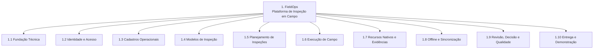

#### 4.3.2 Detalhe por ramo (nível 1 → nível 2)

**1.1 Fundação Técnica**

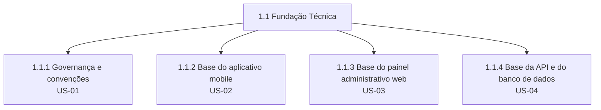

**1.2 Identidade e Acesso**

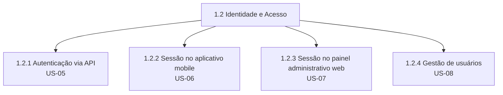

**1.3 Cadastros Operacionais**

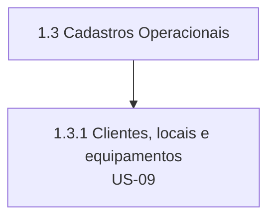

**1.4 Modelos de Inspeção**

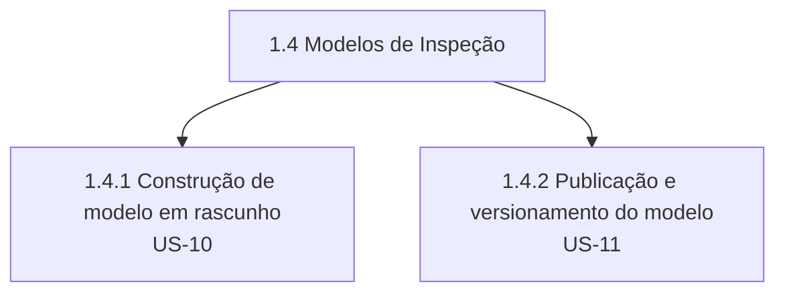

**1.5 Planejamento de Inspeções**

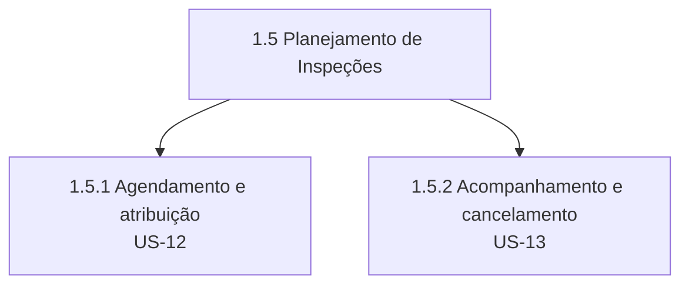

**1.6 Execução de Campo**

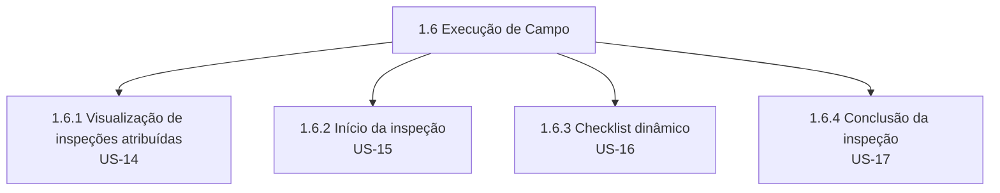

**1.7 Recursos Nativos e Evidências**

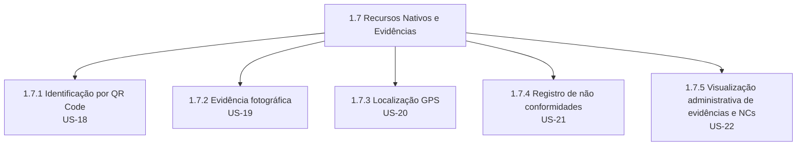

**1.8 Offline e Sincronização**

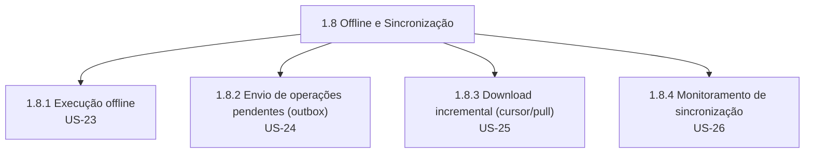

**1.9 Revisão, Decisão e Qualidade**

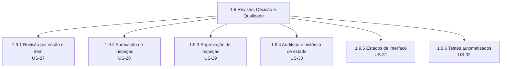

**1.10 Entrega e Demonstração**

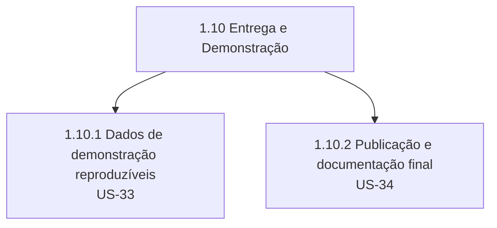

---

## 5. Dicionário da EAP

| Código | Elemento | Descrição | Critério de conclusão | Issues |
|---|---|---|---|---|
| 1.1 | Fundação Técnica | Projetos executáveis (mobile, web, API) padronizados, com lint, tipos e fluxo de PR definidos | As três aplicações rodam localmente com estrutura, convenções e contrato inicial documentados | US-01 a US-04 |
| 1.1.1 | Governança e convenções | Repositório, lint, hooks, template de PR e convenção de commit | Lint e verificação de tipos configurados; PR template e proteção de branch ativos | US-01 (#1) |
| 1.1.2 | Base do aplicativo mobile | Projeto Expo + TypeScript com rotas e componentes base | App inicia, navega entre rotas públicas/protegidas mockadas e exibe componentes base | US-02 (#9) |
| 1.1.3 | Base do painel web | Projeto Angular com layout e rotas | Painel inicia, navega por rotas públicas/protegidas mockadas com layout definido | US-03 (#20) |
| 1.1.4 | Base da API e banco | API Spring Boot conectada ao PostgreSQL via Flyway, com OpenAPI inicial | API sobe, aplica migrations, expõe `/swagger` e responde erros em formato padronizado | US-04 (#26) |
| 1.2 | Identidade e Acesso | Usuários autenticados e autorizados nas três aplicações | Login funcional end-to-end no mobile e no painel, com refresh automático | US-05 a US-08 |
| 1.2.1 | Autenticação via API | Login, refresh e logout com JWT | `POST /auth/login`, `/auth/refresh`, `/auth/logout` funcionais e testáveis via OpenAPI | US-05 (#34) |
| 1.2.2 | Sessão no mobile | Login, persistência segura e logout no app | Sessão sobrevive ao reinício do app; logout limpa dados sensíveis | US-06 (#44) |
| 1.2.3 | Sessão no painel web | Login, interceptador Bearer e logout no painel | Rotas protegidas bloqueadas sem sessão válida; refresh automático funcional | US-07 (#53) |
| 1.2.4 | Gestão de usuários | CRUD de usuários com perfil e situação | Administrador cadastra/edita/inativa usuário; técnico bloqueado em rotas administrativas | US-08 (#59) |
| 1.3 | Cadastros Operacionais | Clientes, locais e equipamentos disponíveis e vinculados | CRUDs completos com filtro encadeado e QR Code único por equipamento | US-09 (#68) |
| 1.3.1 | Clientes, locais e equipamentos | Cadastro hierárquico cliente→local→equipamento | Registro inativo não pode ser usado em nova inspeção; QR Code único validado | US-09 (#68) |
| 1.4 | Modelos de Inspeção | Checklists configuráveis e versionados | Modelo publicado, imutável e disponível para agendamento | US-10, US-11 |
| 1.4.1 | Construção de modelo em rascunho | Seções e itens configuráveis por tipo de resposta | Rascunho editável com seções ordenadas e itens com regras de obrigatoriedade/evidência | US-10 (#80) |
| 1.4.2 | Publicação e versionamento | Versão numerada e imutável do modelo | Publicação bloqueada sem seção/item válido; nova alteração gera nova versão | US-11 (#92) |
| 1.5 | Planejamento de Inspeções | Inspeções agendadas e atribuídas a técnicos ativos | Inspeção criada com snapshot, visível ao técnico após sincronização | US-12, US-13 |
| 1.5.1 | Agendamento e atribuição | Inspeção criada a partir de modelo publicado | Validações de local↔cliente, equipamento↔local e técnico ativo aplicadas | US-12 (#99) |
| 1.5.2 | Acompanhamento e cancelamento | Listagem com filtros e cancelamento auditado | Cancelamento exige justificativa e gera registro de auditoria | US-13 (#107) |
| 1.6 | Execução de Campo | Técnico executa o checklist pelo mobile (fluxo online) | Ciclo início → resposta → conclusão funcional sem evidências nativas | US-14 a US-17 |
| 1.6.1 | Visualização de inspeções atribuídas | Lista e detalhe de inspeções do técnico | Lista mostra estado/prioridade/data/cliente/local; detalhe funciona offline se baixado | US-14 (#113) |
| 1.6.2 | Início da inspeção | Registro formal de início com outbox | Data/hora registradas; API bloqueia início por técnico não autorizado | US-15 (#119) |
| 1.6.3 | Checklist dinâmico | Renderização por tipo de resposta a partir do snapshot | Resposta salva imediatamente em SQLite; progresso recalculado corretamente | US-16 (#125) |
| 1.6.4 | Conclusão da inspeção | Validação de obrigatórios antes de concluir | Conclusão bloqueada com pendência; horário registrado e edição bloqueada após | US-17 (#137) |
| 1.7 | Recursos Nativos e Evidências | QR Code, câmera e localização integrados | Inspeção executada com evidências e NCs visíveis na revisão | US-18 a US-22 |
| 1.7.1 | Identificação por QR Code | Confirmação de equipamento via câmera | Divergência tratada conforme regra; identificação manual disponível sem permissão | US-18 (#146) |
| 1.7.2 | Evidência fotográfica | Captura, prévia e associação ao item | Evidência associada ao item correto; upload pendente criado se offline | US-19 (#152) |
| 1.7.3 | Localização GPS | Coleta pontual no início e na conclusão | Latitude/longitude/precisão/horário armazenados quando disponíveis | US-20 (#161) |
| 1.7.4 | Registro de não conformidades | NC com criticidade e evidência | Criticidade crítica exige evidência; NC funciona offline | US-21 (#167) |
| 1.7.5 | Visualização administrativa de evidências e NCs | Fotos e NCs consultáveis na revisão | Fotos ampliáveis; NCs listadas com criticidade; evidência de inspeção aprovada é somente leitura | US-22 (#173) |
| 1.8 | Offline e Sincronização | Operação sem rede e envio confiável ao servidor | Inspeção concluída offline chega ao servidor sem duplicidade | US-23 a US-26 |
| 1.8.1 | Execução offline | Persistência local completa | Inspeção acessível e editável sem conexão; retomada após reiniciar o app | US-23 (#177) |
| 1.8.2 | Envio de operações pendentes (outbox) | Fila idempotente ordenada por dependência | Reenvio da mesma operação não duplica dado; falha parcial preserva confirmadas | US-24 (#183) |
| 1.8.3 | Download incremental (cursor/pull) | Alterações do servidor aplicadas localmente | Cursor avança só após persistência local; conflito detectado sem sobrescrever dado local | US-25 (#191) |
| 1.8.4 | Monitoramento de sincronização | Visibilidade de pendências e falhas | Tela exibe pendências, falhas e última sincronização bem-sucedida | US-26 (#198) |
| 1.9 | Revisão, Decisão e Qualidade | Supervisor revisa, aprova ou reprova; qualidade validada | Ciclo completo de revisão com histórico auditável e testes cobrindo fluxos críticos | US-27 a US-32 |
| 1.9.1 | Revisão por seção e item | Navegação pelas respostas da inspeção enviada | Início formal de revisão muda estado e é auditado | US-27 (#202) |
| 1.9.2 | Aprovação de inspeção | Decisão positiva com proteção de dados | Estado muda para Aprovada; respostas protegidas contra edição comum | US-28 (#209) |
| 1.9.3 | Reprovação de inspeção | Decisão negativa com motivo obrigatório | Reprovação sem motivo bloqueada; técnico recebe motivo na próxima sincronização | US-29 (#215) |
| 1.9.4 | Auditoria e histórico de estado | Registro e consulta de transições críticas | Histórico mínimo consultável na revisão administrativa | US-30 (#221) |
| 1.9.5 | Estados de interface | Loading, vazio, erro e offline tratados | Todos os fluxos críticos tratam os quatro estados nas duas interfaces | US-31 (#225) |
| 1.9.6 | Testes automatizados | Cobertura dos fluxos críticos | Componentes de checklist, endpoints críticos e outbox cobertos por testes | US-32 (#231) |
| 1.10 | Entrega e Demonstração | Produto integrado apresentável ponta a ponta | Demonstração completa executável a partir do README, sem edição manual de banco | US-33, US-34 |
| 1.10.1 | Dados de demonstração reproduzíveis | Seed idempotente para todos os perfis | Reexecução do seed não duplica dados | US-33 (#239) |
| 1.10.2 | Publicação e documentação final | Build Android, deploy web, contêiner API, README final | Avaliador executa o projeto usando apenas a documentação disponibilizada | US-34 (#245) |

---

## 6. Matriz de Rastreabilidade EAP → Issues

| Código EAP | Elemento da EAP | Issues relacionadas (US + faixa de TS) | Entregável |
|---|---|---|---|
| 1.1.1 | Governança e convenções | US-01 (#1) + TS-01-01..07 (#2–#8) | Repositório com convenções, lint e fluxo de PR ativos |
| 1.1.2 | Base do aplicativo mobile | US-02 (#9) + TS-02-01..10 (#10–#19) | Projeto Expo navegável com dados mockados |
| 1.1.3 | Base do painel web | US-03 (#20) + TS-03-01..05 (#21–#25) | Projeto Angular navegável com telas mockadas |
| 1.1.4 | Base da API e banco | US-04 (#26) + TS-04-01..07 (#27–#33) | API executável com PostgreSQL, Flyway e OpenAPI inicial |
| 1.2.1 | Autenticação via API | US-05 (#34) + TS-05-01..09 (#35–#43) | Endpoints de login/refresh/logout funcionais |
| 1.2.2 | Sessão no mobile | US-06 (#44) + TS-06-01..08 (#45–#52) | Login real integrado no app, com persistência segura |
| 1.2.3 | Sessão no painel web | US-07 (#53) + TS-07-01..05 (#54–#58) | Login real integrado no painel, com guard ativo |
| 1.2.4 | Gestão de usuários | US-08 (#59) + TS-08-01..08 (#60–#67) | CRUD de usuários operável pelo painel |
| 1.3.1 | Clientes, locais e equipamentos | US-09 (#68) + TS-09-01..11 (#69–#79) | Cadastros disponíveis com QR Code por equipamento |
| 1.4.1 | Construção de modelo em rascunho | US-10 (#80) + TS-10-01..11 (#81–#91) | Construtor de modelo funcional no painel |
| 1.4.2 | Publicação e versionamento | US-11 (#92) + TS-11-01..06 (#93–#98) | Modelo publicado, versionado e imutável |
| 1.5.1 | Agendamento e atribuição | US-12 (#99) + TS-12-01..07 (#100–#106) | Inspeção criada e atribuída, visível ao técnico |
| 1.5.2 | Acompanhamento e cancelamento | US-13 (#107) + TS-13-01..05 (#108–#112) | Listagem administrativa com cancelamento auditado |
| 1.6.1 | Visualização de inspeções atribuídas | US-14 (#113) + TS-14-01..05 (#114–#118) | Lista e detalhe de inspeções no mobile |
| 1.6.2 | Início da inspeção | US-15 (#119) + TS-15-01..05 (#120–#124) | Início formal registrado, com entrada na outbox |
| 1.6.3 | Checklist dinâmico | US-16 (#125) + TS-16-01..11 (#126–#136) | Checklist respondido e persistido localmente |
| 1.6.4 | Conclusão da inspeção | US-17 (#137) + TS-17-01..08 (#138–#145) | Inspeção concluída com validação de obrigatórios |
| 1.7.1 | Identificação por QR Code | US-18 (#146) + TS-18-01..05 (#147–#151) | Confirmação de equipamento via câmera |
| 1.7.2 | Evidência fotográfica | US-19 (#152) + TS-19-01..08 (#153–#160) | Foto capturada, associada e enviada ao servidor |
| 1.7.3 | Localização GPS | US-20 (#161) + TS-20-01..05 (#162–#166) | Coordenadas de início/conclusão registradas |
| 1.7.4 | Registro de não conformidades | US-21 (#167) + TS-21-01..05 (#168–#172) | NC registrada com criticidade e evidência |
| 1.7.5 | Visualização administrativa de evidências e NCs | US-22 (#173) + TS-22-01..03 (#174–#176) | Revisão exibe fotos e NCs por item |
| 1.8.1 | Execução offline | US-23 (#177) + TS-23-01..05 (#178–#182) | Inspeção executável e persistente sem rede |
| 1.8.2 | Envio de operações pendentes (outbox) | US-24 (#183) + TS-24-01..07 (#184–#190) | Fila idempotente enviando dados ao servidor |
| 1.8.3 | Download incremental (cursor/pull) | US-25 (#191) + TS-25-01..06 (#192–#197) | Estado do servidor refletido localmente sem sobrescrever pendências |
| 1.8.4 | Monitoramento de sincronização | US-26 (#198) + TS-26-01..03 (#199–#201) | Tela de status de sincronização no app |
| 1.9.1 | Revisão por seção e item | US-27 (#202) + TS-27-01..06 (#203–#208) | Tela de revisão navegável com auditoria de início |
| 1.9.2 | Aprovação de inspeção | US-28 (#209) + TS-28-01..05 (#210–#214) | Fluxo de aprovação com dados protegidos |
| 1.9.3 | Reprovação de inspeção | US-29 (#215) + TS-29-01..05 (#216–#220) | Fluxo de reprovação propagado ao técnico |
| 1.9.4 | Auditoria e histórico de estado | US-30 (#221) + TS-30-01..03 (#222–#224) | Histórico de transições consultável |
| 1.9.5 | Estados de interface | US-31 (#225) + TS-31-01..05 (#226–#230) | Estados de loading/vazio/erro/offline consistentes |
| 1.9.6 | Testes automatizados | US-32 (#231) + TS-32-01..07 (#232–#238) | Suíte de testes cobrindo fluxos críticos |
| 1.10.1 | Dados de demonstração reproduzíveis | US-33 (#239) + TS-33-01..05 (#240–#244) | Seed idempotente pronto para demonstração |
| 1.10.2 | Publicação e documentação final | US-34 (#245) + TS-34-01..07 (#246–#252) | Build Android, deploy web, contêiner API e README final |

**Verificação de cobertura**: das 252 issues do repositório, todas as 34 User Stories e todas as 218 Tasks aparecem em exatamente uma linha da matriz acima — não há issue sem correspondência na EAP, nem elemento da EAP sem issue associada. Detalhamento em §9.

---

## 7. Problemas Encontrados no Backlog

| # | Problema | Evidência | Correção sugerida |
|---|---|---|---|
| 1 | **Ausência de campo de dependência no schema** | `github-kanban/backlog.yaml` não define `depends_on` (nem em `fields:` nem por item) | Adicionar campo `depends_on: [ID, ...]` ao schema de `user_stories`/`tasks`, permitindo que `sync_backlog.py` registre a dependência também como relação no GitHub Projects |
| 2 | **Prioridade não diferenciada** | 100% das 252 issues estão como `priority: High`, apesar de o schema (`README.md` do `github-kanban`) prever `Low/Medium/High/Critical` | Revisar prioridades por User Story à luz da política de corte de escopo já definida em `roadmap.md` §16.7, marcando como `Critical` os itens listados no passo 7 dessa política ("manter obrigatoriamente") |
| 3 | **Estimativa de tasks uniforme (1 ponto para todas)** | Todas as 218 tasks têm `story_points: 1`, independentemente de complexidade (ex.: "Configurar Spring Security com filtro de autenticação JWT" tem a mesma pontuação que "Adicionar `.gitignore`, `.editorconfig` e README inicial") | Reservar `story_points` de task para esforço relativo real, ou remover o campo no nível de task e manter estimativa apenas em User Story (que já usa uma escala tipo Fibonacci de 3 a 13) |
| 4 | **Conflito de ordem de execução dentro da Sprint 7** | TS-30-01 (criação da tabela `audit_log`) está sequenciada depois de TS-27-06, TS-28-02 e TS-29-02, que gravam nessa tabela | Executar TS-30-01 no início da Sprint 7, antes das demais tasks de auditoria (ver §3.3) |
| 5 | **User Story sobredimensionada** | US-09 concentra 3 subdomínios (clientes, locais, equipamentos), 13 pontos e 11 tasks — o dobro de tasks da média das demais US da Sprint 2 (5,25 tasks/US) | Decompor US-09 em três User Stories (US-09a Clientes, US-09b Locais, US-09c Equipamentos) para acompanhamento individual mais granular |
| 6 | **Testes concentrados em uma única sprint** | US-32 (testes automatizados) está inteiramente na Sprint 7, cobrindo retroativamente funcionalidades construídas desde a Sprint 1 | Ver recomendação de distribuição incremental de testes no `cronograma.md` §9 |
| 7 | **Títulos de sprint no YAML combinam épicos de forma não explícita** | O comentário `# Sprint 7: Revisão, decisão e qualidade` mistura EP-09 (Revisão e decisão) e parte de EP-10 (Qualidade e entrega) definidos em `backlog-do-produto.md` §15.2, sem que essa fusão esteja documentada explicitamente em nenhum dos dois arquivos | Registrar explicitamente, em `backlog-do-produto.md`, que EP-10 é executado em duas frentes (qualidade → Sprint 7; entrega → Sprint 8) — o que este documento já assume em §4.1 |

---

## 8. Lacunas de Planejamento Identificadas

Conforme a regra de não invenção de escopo, os itens abaixo **não foram adicionados à EAP nem à matriz de rastreabilidade**. São registrados aqui como observações para eventual decisão da equipe.

| # | Lacuna | Por que pode ser necessária | Sugestão (fora do escopo atual) |
|---|---|---|---|
| 1 | Nenhuma issue trata explicitamente de **performance e acessibilidade** como item rastreável, apesar de `roadmap.md` §16.5 (Semana 14) descrever "otimizações", "correções de acessibilidade" e "profiling" como conteúdo pedagógico da semana | US-31 cobre apenas estados de interface (loading/vazio/erro/offline), não desempenho de listas longas nem auditoria de acessibilidade (contraste, rótulos, navegação por teclado/leitor de tela) | Poderia existir uma User Story "US-35 (sugestão): Otimizar performance e acessibilidade das interfaces", com tasks de profiling de listas, otimização de imagens e checagem de contraste/rótulos — a decidir pela equipe |
| 2 | Nenhuma issue cobre **dashboard de indicadores** para supervisão, embora seja objetivo específico declarado em `docs/objetivos.md` §2.4 ("Fornecer indicadores básicos para supervisão") | O objetivo consta na visão de produto, mas foi conscientemente postergado — já aparece como item pós-MVP `PBI-073` em `docs/backlog-do-produto.md` §15.4 | **Não é uma lacuna silenciosa** — já está registrada e deliberadamente fora do MVP. Mantida aqui apenas para explicitar a rastreabilidade objetivo → decisão de escopo |
| 3 | Nenhuma issue trata de **rotação/expiração de certificados HTTPS ou configuração de CORS** em ambiente de demonstração, apesar de `arquitetura.md` §11.10 exigir HTTPS em ambientes publicados e CORS restrito | US-34 cobre build/deploy/contêiner, mas não detalha configuração de HTTPS/CORS como critério de aceitação explícito | Poderia ser incorporada como critério de aceitação adicional de US-34/TS-34-06, sem necessidade de nova issue |

---

## 9. Validação de Cobertura da EAP

- **Todas as issues foram contempladas?** Sim — as 34 User Stories e as 218 Tasks (252 issues) estão mapeadas em exatamente um elemento da EAP (Seção 6).
- **Existem issues sem correspondência na EAP?** Não.
- **Existem elementos da EAP sem issues correspondentes?** Não — todo pacote de trabalho de nível 2 (34 no total) tem ao menos uma User Story e suas tasks associadas.
- **Existe alguma inferência apresentada como requisito existente?** Não. Toda relação de dependência (Seção 3) e a fusão de épicos na Seção 4.1 estão explicitamente marcadas como inferência, com a fonte textual que a sustenta.
- **Foi adicionado escopo não presente nas issues?** Não. As lacunas identificadas (Seção 8) estão isoladas do corpo principal da EAP e não geraram nós, códigos ou entregáveis novos.

**Conclusão**: a EAP cobre 100% do backlog levantado, com rastreabilidade bidirecional (EAP → issues e issues → EAP) verificada. Prossiga para o [`cronograma.md`](./cronograma.md) para o planejamento temporal por sprint.
